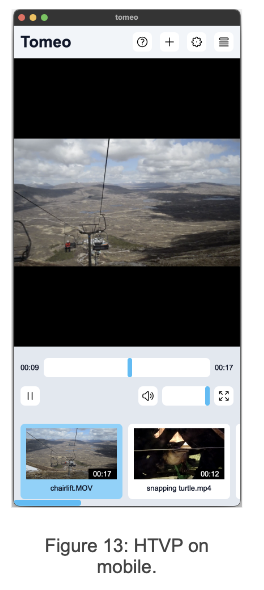
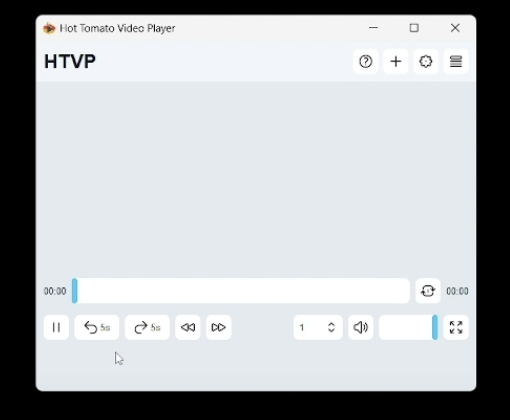

# Hot Tomato Video Player (HTVP)

## Introduction (see videos for presentation)

HTVP (Hot Tomato Video Player) is a responsive, feature-rich video player built using the desktop Qt framework (version 5.15.2). Initially designed as a tablet application, its responsiveness allows it to be used on both desktop and mobile devices. Throughout development, we followed agile methodologies, using Kanban boards to manage tasks and user feedback to guide iterations.

## Key Features

- Basic media controls: play, pause, fast-forward, and rewind.
- Volume slider and mute button.
- Video selection and playback functionality.
- UI elements optimized for different devices and screen sizes.
- Playlist management and recent video history.

## Iteration Overview

### **First Iteration: Prototyping**

**Goals:**

- Implement basic media player controls.
- Provide a user-friendly interface.
- Gather early feedback through wireframes and a use case diagram.

**Achievements:**

- Basic functionalities (play, pause, volume control) implemented.
- Initial UI design based on feedback.
- Early prototypes inspired by VLC and YouTube interfaces.

**Evaluation:**

- Feedback gathered via a user questionnaire revealed issues with video importing, leading to future improvements.

### **Second Iteration: User-Requested Features**

**Goals:**

- Incorporate user feedback from the first iteration.
- Enhance UI and add functionalities like recent video tab, drag-and-drop video loading, and next/previous buttons.

**Achievements:**

- Features such as video deletion, custom themes, and improved settings were implemented.
- Prototyped UI improvements using paper sketches.

**Evaluation:**

- User experience improved, but some edge cases revealed bugs that were noted for future iterations.

### **Third Iteration: Polishing and Bug Fixes**

**Goals:**

- Focus on bug fixing and polishing existing functionalities.
- Design responsive layouts for both desktop and mobile use.
- Add a help page and additional user guidance.

**Achievements:**

- Vertical and horizontal layouts implemented.
- A help menu introduced to improve user understanding.
- Playlist thumbnails, video duration, and dark/light themes added.

**Evaluation:**

- A final user survey confirmed this version as the most successful, with improved usability and minimal bugs.
