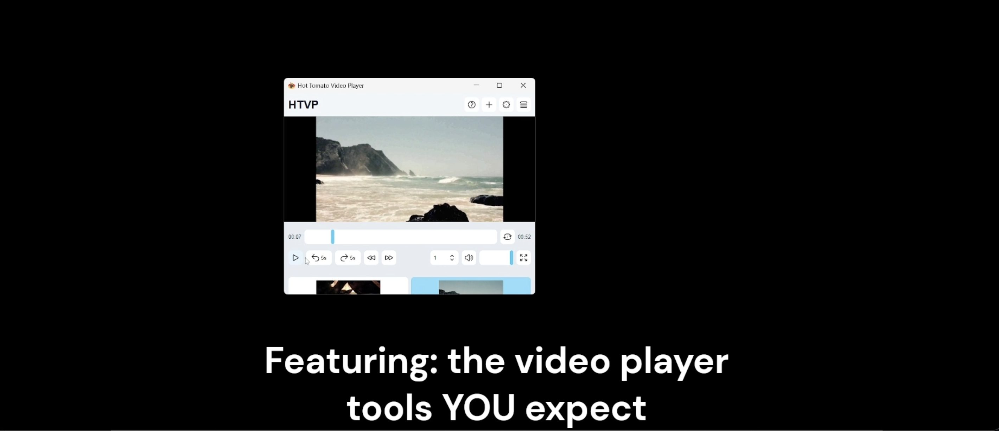
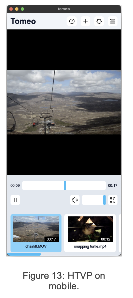

# Hot Tomato Video Player (HTVP)

A responsive video player I built with a small team for university. It's a Qt desktop app that just plays videos, but with a proper UI that scales nicely across desktop, tablet, mobile sizes and supports quite a few cool features. Have a look at the video (:

> Commit history got scrambled as this project was migrated from a private university repo.

[](https://youtu.be/sPTKfwrXlgI)



## The Interesting Bits

### Responsive UI

Most "responsive" apps just reflow text. HTVP actually adapts:

- Speed dropdown, fast-forward, and rewind buttons hide below 600px width
- Next/previous and repeat buttons vanish below 400px
- Volume slider disappears below 300px

Hit a breakpoint and the layout reflows without anything breaking.

### Theming Without Tears

Themes work through Qt's property system. Set one property on the root widget and it cascades to all children:

```cpp
setProperty("theme", "dark");
setProperty("buttonSize", "large");
```

Then your QSS just targets by property:

```css
*[theme="dark"] * {
  background-color: #334155;
}
```

No manually updating every widget when the user switches themes.

### Panel Collapsing

The settings and recents panels toggle with mutual exclusivity opening one automatically closes the other.

### App Restart Mechanism

Some settings need a full restart to apply (theme, button size, default directory). The app handles this cleanly with a `do...while` loop in main, it exits with code 1234 and relaunches. Feels seamless to the user.

### Platform-Specific Weirdness

Turns out Qt Multimedia behaves differently across platforms:

- Windows doesn't support playback speed changes, so that control gets hidden
- Linux fullscreen doesn't work well, so that button gets hidden too
- WMV files report as `application/vnd.ms-asf` mime type instead of video, so there's a workaround for that

### Signal/Slot Architecture

Qt's signal/slot system is pretty neat for decoupling UI from logic. The main window acts like a coordinator: player signals bubble up, controls respond, settings propagate. Over 40+ signal connections keeping everything loosely coupled.

### Tutorial System

First-time users get a friendly banner that says "Press the + button to add videos." It auto-dismisses the moment you add your first file. No annoying "show me around" modal.

### Keyboard Shortcuts

Full keyboard control:

- Space to play/pause
- Arrow keys for seeking and volume
- M to mute, F for fullscreen
- Shift+N/P for next/previous

## Architecture

```
┌─────────────────────────────────────────────────────────────┐
│                      TheWindow                              │
│                   (main coordinator)                        │
├─────────────────────────────────────────────────────────────┤
│  ThePlayer             │  TheVideo           │  TheStore    │
│  ├─ QMediaPlayer       │  ├─ Keyboard input  │  ├─ Settings │
│  ├─ QMediaPlaylist     │  ├─ Drag & drop     │  └─ History  │
│  └─ Video loading      │  └─ Display widget  │              │
│                        │                     │              │
│  TheControls           │  TheAppBar          │  TheRecents  │
│  ├─ Playback buttons   │  ├─ Navigation      │  └─ Recent   │
│  ├─ Volume slider      │  └─ Window controls │    videos    │
│  ├─ Progress bar       │                     │              │
│  └─ Speed dropdown     │                     │              │
└─────────────────────────────────────────────────────────────┘
```

## Project Structure

```
VideoPlayer/
├── code/
│   ├── tomeo.cpp            # Main entry point, handles app restart
│   ├── the_window.h/cpp     # Main window, signal/slot coordinator
│   ├── the_player.h/cpp     # QMediaPlayer wrapper, playlist, directory loading
│   ├── the_video.h/cpp      # Video display widget, keyboard handling
│   ├── the_controls.h/cpp   # Playback controls, responsive visibility
│   ├── the_appbar.h/cpp     # Top bar with navigation and window controls
│   ├── the_recents.h/cpp    # Recent videos panel
│   ├── the_settings.h/cpp   # Settings panel with all the options
│   ├── the_buttons.h/cpp    # Thumbnail buttons for playlists
│   ├── the_store.h/cpp      # JSON config persistence
│   ├── the_utils.h/cpp      # Shared utilities (time formatting, etc.)
│   ├── a_video.h/cpp        # Video data container
│   ├── styles/              # Qt stylesheets (QSS)
│   │   ├── globals.qss
│   │   ├── the_controls.qss
│   │   ├── the_appbar.qss
│   │   └── ...
│   └── icons/               # UI icons
├── Images/                  # README screenshots
├── README.md
└── LICENSE
```

## Tech Stack

- **Qt 5.15.2** - Desktop framework
- **C++11**
- **Qt Widgets** - GUI components
- **Qt Multimedia** - QMediaPlayer for playback
- **QSS** - Styling (CSS for Qt)

## Building

```bash
cd code
qmake the.pro
make
./tomeo    # or tomeo.exe on Windows
```

You will need Qt 5.15.2 and the multimedia module installed.

## More Details

For the full technical breakdown (design decisions, iteration history, user research, and everything else) see [ProjectDocumentation.pdf](./ProjectDocumentation.pdf).

## Iteration Videos

Watch the app evolve over three iterations:

- [Iteration 1 - Initial prototype](https://youtu.be/jrpVTVlgRuw)
- [Iteration 2 - Feature additions](https://youtu.be/D9u4u7tyQrc)
- [Iteration 3 - Final polish](https://youtu.be/Mhzum5tXQts)

## Contributors

- **Michael Wiciak** - Primary worked on responsive UI, multi-platform compatability and design/architecture
- **William Neild**
- **Brooklyn Mcswiney**
- **Lai Ting Yeung**
